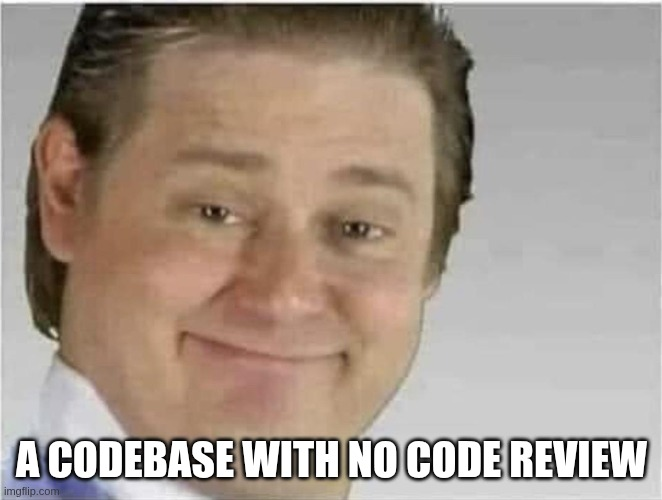
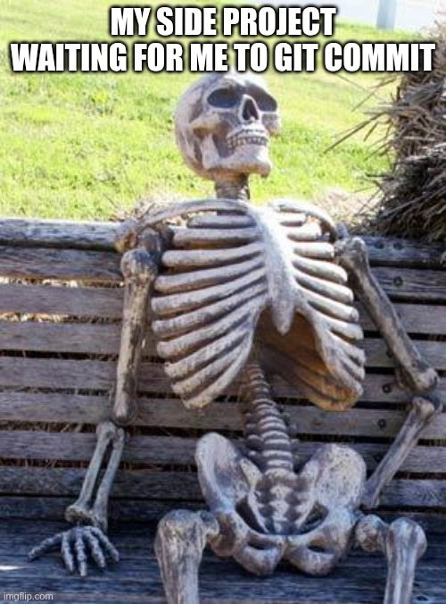
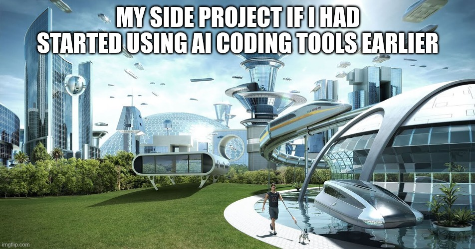

*The honest story of a side project that died, came back, and taught me more than I expected.*

---

## The spreadsheet problem

Like many engineers, I used to track my budget in a spreadsheet. Every month, the same ritual: download bank statements, copy-paste into cells, manually adjust formulas. I had a major home renovation going on, and the recurring question was always: **"Can I afford the next round of work, and when?"**

I looked at existing apps. They had nice dashboards and direct bank connections, but none of them could forecast my balance the way I needed. They were built for looking backward — "here's what you spent last month." I wanted to look forward — "here's where your balance will be on March 15th if you go ahead with that purchase."

So I opened a Jupyter notebook.

## The first two weeks

I was giddy like a junior on their first side project. No Jira ticket, no sprint review, no PR approval — just me, a blank `main.py`, and zero accountability.



I started writing actual Python modules — not a notebook. I spent a lot of time on what might seem premature for a personal script: **the core abstractions**. Amount, DateRange, Category. I knew from my day job that these foundational types would underpin everything else, and that changing them later would mean rewriting half the codebase.

Jupyter came in as a companion tool — I'd import my modules into a notebook to plot balance curves, render tables, and validate results visually. It was a fast feedback loop: write the logic in proper code, explore and visualize in Jupyter.

I also wanted to share results with my partner — we manage the household budget together. Jupyter notebooks aren't exactly user-friendly for non-developers, so I quickly pivoted to a CLI that would spit out Excel files. An AI coding assistant helped me ramp up on pandas fast enough to get something working.

Within a couple of weeks, I had a functional version. It could import BNP bank statements, categorize transactions with keyword matching, and generate a basic forecast. It wasn't pretty, but it answered the question.

## The refactor that broke everything

And then I looked at the code and thought: *this is ugly.*

The pragmatic move would have been to leave it alone — it worked, it solved my problem. But this was my personal project, the one place where nobody could tell me to stop over-engineering. No deadlines, no trade-offs, no "good enough." I wanted clean layers, proper separation of concerns, a real architecture. So I started refactoring.

I broke everything.


The output was wrong, and I had **zero tests** to tell me where. My only reference was the Excel export from the previous working version — my "production" data, if you can call it that for a personal project. So I did what every developer does when they're lost:

```python
print("I want my money back", forecast.balance, expected)
```

Sprinkled everywhere, trying to compare values and spot where things diverged. With a full bank history flowing through the pipeline, that was a lot of data to eyeball.

So I did something I should have done from the start: I wrote tests. Not out of discipline or best practices — out of desperation. I needed to isolate small pieces of behavior, pin down what was expected, and figure out what was broken without drowning in print output.

I eventually got it working again. Pushed it to GitHub — private repo. I wasn't proud enough to show it to anyone.

## The desert

Then life happened. Young kids, a demanding job, limited bandwidth. The project went quiet.

For almost **a year**, the repository sat there collecting dust. A handful of issues I'd jot down — "add Swile import," "improve categorization," "build a proper UI" — knowing I'd probably never get to them.



I'd still fix bugs occasionally, but here's the shameful part: I wouldn't commit. I had set up pre-commit hooks — linting, type checking — and I knew my fixes would fail them. And fixing the hooks properly meant writing regression tests I didn't have the energy for. So I'd patch the code, verify it worked on my data, and just... leave it uncommitted. A disciplined enough setup to feel guilty, not disciplined enough to actually follow through.

It's the classic side project graveyard. Not abandoned with a dramatic decision, just... slowly starved of attention. Every few weeks I'd open the repo, look at the issue list, think "I don't have the energy for this," and close the tab.

I think most developers have a project like this. The one that works "well enough" but never becomes what you imagined. You're not proud of it, but you can't quite let it go either.

## The second wind

Two things happened in late 2025 that broke the stalemate.

First, I set myself a new goal: **make the project public**. Not "someday." Actually public, on GitHub, with my name on it. That changed everything. Suddenly the issue list wasn't a guilt trip — it was a roadmap. I went through the codebase methodically: purged personal financial data, scrubbed the git history, reviewed every file for anything I wouldn't want a stranger to see. I wrote a proper README, added a demo dataset, set up CI/CD. The bar wasn't perfection — it was "would I be comfortable sharing this link?"

Second, I started using an AI coding agent. And the **effort-to-result ratio** changed dramatically. The SQLite migration I'd been dreading? Done in an evening. The terminal UI I'd sketched in my head but never started? Built iteratively over a few sessions. Internationalization, documentation, test coverage — all the "important but not urgent" work that a solo developer perpetually postpones.



The goal gave me direction. The AI gave me speed. In barely two months, the project went from a dormant private repo to a public application with a full terminal UI built with Textual, comprehensive documentation, and a demo dataset so anyone could try it.

But the most valuable part wasn't the code output. It was **the learning loop**.

I was configuring the AI agent on my side project — writing rules, prompts, workflows — with zero pressure. No deadlines, no code review, no production risk. Just experimentation. And then I'd bring those patterns to my day job: I gave an internal talk on the setup, applied it to production projects, refined the approach based on real-world constraints. And the engineering habits from work — architectural discipline, quality standards, testing strategies — would flow back into the side project.

Side project → work → side project. A virtuous cycle that neither could have created alone. I'll dig deeper into the concrete setup — rules, skills, workflows — in a future article.

## What I'd do differently

**Write tests before refactoring.** This one cost me weeks. I had a working application and I tore it apart without any safety net. The tests I wrote afterward — in a panic, trying to understand what I'd broken — were more valuable than any test I've written since. Not because they were good tests, but because they taught me viscerally why tests exist. They're not proof of quality. They're a survival tool. Martin Fowler puts it simply in *Refactoring*: "Before you start refactoring, make sure you have a solid suite of tests." I wish I'd read that chapter before I started mine.

**Ship earlier.** I kept the repo private for over a year because I wasn't proud of the code. That was ego, not strategy. When I finally decided to go public, I spent time on a real checklist: purge personal data from the history, review every config file, write a decent README, add a demo dataset. That preparation was necessary — but the months of hesitation before it weren't. Nobody was going to audit my personal budget app for architectural purity. The moment I finally published it, nothing bad happened. No harsh criticism, no "well actually" comments. Just a few thumbs up on LinkedIn and the quiet relief of having shipped something.

**Lower the startup friction.** What nearly killed this project wasn't lack of motivation — it was the activation energy required every time I sat down. Each open issue meant learning a new library, understanding a complex topic from scratch, or untangling code I'd half-forgotten. With two young kids and a demanding job, "figure out SQLite migrations tonight" just couldn't compete with sleep. What changed wasn't my discipline — it was the friction. An AI agent turned multi-evening tasks into single-session ones, and that made all the difference.

## What it taught me

A side project doesn't need users, revenue, or a Product Hunt launch to be worth building. It needs to **teach you something you can't learn at work**.

At work, I operate within existing architectures, established patterns, team decisions. That's valuable, but it's bounded. On my side project, every decision was mine — and every mistake was mine too. The architecture that seemed overkill for a simple script became essential as the project grew. The testing discipline I resisted at first saved me during every major refactor. The AI workflow I experimented with became a competitive advantage at my day job.

Oh, and my partner? She never really used the app directly — I'd run the forecasts and share the results. But the few times she opened an Excel export on her own and said "this makes sense," that felt better than any code review approval.

The real product was never the app. It was what I became while building it.

---

*The project is open source at [github.com/corentin-core/budget-forecaster](https://github.com/corentin-core/budget-forecaster). If you've got a side project gathering dust, maybe it just needs a different kind of push.*
